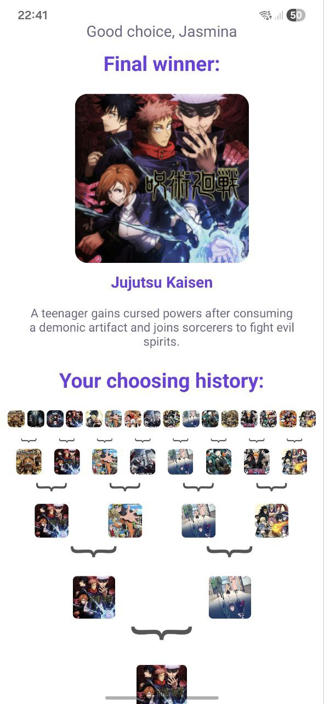

# Aplicație de Clasament cu Componente de Bază

## Descriere Proiect
Această aplicație permite utilizatorilor să participe la un sistem de clasament, alegând preferințele dintre obiecte (anime-uri în exemplu). Aplicația înregistrează alegerile și afișează rezultatul final, împreună cu istoricul selecțiilor fiecărui utilizator.
### Tehnologii și Configurare
- Proiect realizat cu `React Native` și `Expo`.
- Datele obiectelor (anime-urilor) sunt stocate în fișiere `.json`.
- Stilizarea este realizată cu `StyleSheet` și componente de bază `React Native`: `View`, `Text`, `ScrollView`, `Image`, `Pressable` etc.
- Folosește `AsyncStorage` pentru salvarea și actualizarea datelor utilizatorilor.
## Funcționalități Implementate
### 1. Sistemul de Clasament
Utilizatorii pot:
- Vizualiza la sfârșit clasamentul obiectelor pentru care a votat.
- Vota pentru obiectul preferat, având de făcut o alegeri a câte 2 până se ajunge la o selecție finală.
### 2. Sistemul de Votare
Fiecare obiect are:
- Nume și descriere (descrierea e afișată la final pentru obiectul selectat).
- Imagine asociată
### 3. Panoul de Statistici
- Afișează istoricul selecției fiecărui utilizator.
- Inițial utilizatorul își include numele, pentru a putea fi salvat rezultatul, în caz că deja acesta are o selecție, rezultatul e actualizat cu cel nou.
